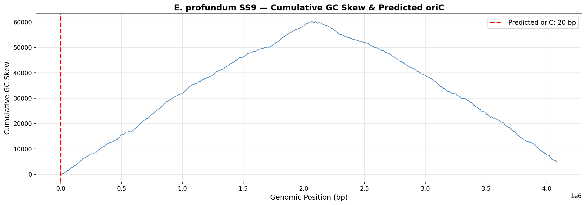

# 🧬 BioInfo Toolkit

Implementing core bioinformatics algorithms from scratch, applied to real genomic data from *Exiguobacterium profundum* — a deep-sea bacteria.

## Modules

| Module | Algorithm | Application |
|--------|-----------|-------------|
| smith_waterman.py | Smith-Waterman local alignment | 16S rRNA comparison |
| ori_finder.py | GC-skew analysis | oriC prediction in P. profundum |
| debruijn_assembler.py | de Bruijn graph assembly | 16S sequence assembly |

## Results

### Predicted oriC in P. profundum

### de Bruijn Assembly vs Original
Assembly achieved perfect alignment score of 400.0 over 787 bp of 16S rRNA sequence.

## How to Run

Install dependencies:
pip install -r requirements.txt

Run Smith-Waterman:
python -c "from src.smith_waterman import SmithWaterman; sw=SmithWaterman(); print(sw.format_alignment('ACGTACGT','ACGTTCGT'))"

Run Ori-Finder:
python scripts/run_ori_finder.py data/sample/e_profundum_genome.fasta

Run Assembler:
python scripts/run_assembler.py data/sample/sequence_16S.fasta

Run Tests:
pytest tests/ -v

## Background
This project connects three levels of biological analysis:
- Wet lab: Isolation and characterization of marine microorganisms
- Comparative genomics: Phylogenetics and pan-genome analysis
- Algorithmic bioinformatics: This repository

## License
MIT License